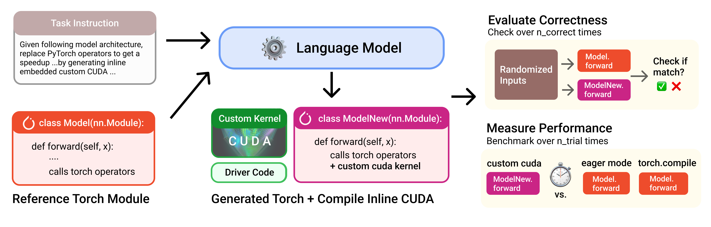

# KernelBench: Can LLMs Write Efficient GPU Kernels? [ICML '25]
[arXiv](https://arxiv.org/html/2502.10517v1) | [blog post](https://scalingintelligence.stanford.edu/blogs/kernelbench/) | [HuggingFace Dataset](https://huggingface.co/datasets/ScalingIntelligence/KernelBench) | 

## Versions
The huggingface dataset is updated to v0.1.
- [v0.1](https://github.com/ScalingIntelligence/KernelBench/tree/v0.1) - Latest version (also main branch)
- [v0](https://github.com/ScalingIntelligence/KernelBench/tree/v0) - Original Release

A benchmark for evaluating LLMs' ability to generate efficient GPU kernels


<!-- See [blog post](https://scalingintelligence.stanford.edu/blogs/kernelbench/) and [arXiv paper](https://arxiv.org/html/2502.10517v1) for more details. -->

## 👋 Task Description
We structure the problem for LLM to transpile operators described in PyTorch to CUDA kernels, at whatever level of granularity it desires to.


We construct KernelBench to have 4 Levels of categories:
- **Level 1 🧱**:  Single-kernel operators (100 Problems)
    The foundational building blocks of neural nets (Convolutions, Matrix multiplies, Layer normalization)
- **Level 2 🔗**:  Simple fusion patterns (100 Problems)
    A fused kernel would be faster than separated kernels (Conv + Bias + ReLU, Matmul + Scale + Sigmoid)
- **Level 3 ⚛️**:  Full model architectures (50 Problems)
    Optimize entire model architectures end-to-end (MobileNet, VGG, MiniGPT, Mamba) 
- **Level 4 🤗**:  Level Hugging Face 
    Optimize whole model architectures from HuggingFace

We are actively extending KernelBench to other DSLs beyond `cuda` as well.

## ⚖️ Evaluation
#### Methodology
To evaluate model-generated kernels, we need to check if they:
- **is correct ✅**: check against reference torch operators `n_correctness` times on randomized inputs.
- **is performant ⏱️**: compare against reference torch operators `n_trial` times to measure speedup between runtimes.

Check out `src/eval.py` for details on how we implement correctness check and timing. 

We provide a convenient script `scripts/run_and_check.py` to evaluate one single sample source code against a reference source code, check correctness and compute speedup. You can use this to evaluate a model-generated kernel. 

#### Overall Benchmark Metric

Since we need to capture **both** correctness and performance, we define a metric `fast_p`: fraction of tasks that are both correct and have a speedup greater than threshold `p`; speedup is computed as the ratio of PyTorch reference wall-clock time to generated kernel time.

Some examples to illustrate this metric that filters based on speedups:
* `fast_1` is the fraction of tasks that LM-generated kernels are both correct and **faster** than PyTorch baseline
* `fast_2` is the fraction of tasks that LM-generated kernels are both correct and **at least 2x faster** than PyTorch baseline
* `fast_0` is the fraction of tasks that LM-generated kernels are **correct**. (same as correctness rate)

You can increase speedup threshold `p` to make the task more challenging.


#### Compute Overall Benchmark Performance

We provide a script `scripts/greedy_analysis.py` to compute the overall benchmark performance. 
Since we need to capture **both** correctness and performance, we use a metric `fast_p`: fraction of tasks that are both correct and have a speedup greater than threshold `p`; speedup is computed as the ratio of PyTorch reference wall-clock time to generated kernel time.

<!-- TODO: update to provide fast_p measurement script -->

## 🔍 Directory Structure
We organize the repo into the following structure:
```
KernelBench/
├── assets/
├── KernelBench/ # Benchmark dataset files
├── src/ # KernelBench logic code
│   ├── unit_tests/  
│   ├── prompts/
│   ├── ....
├── scripts/ # helpful scripts to run the benchmark
├── results/ # baseline times across hardware 
├── runs/ # where your runs will be stored
```

## 🔧 Set up
```
conda create --name kernel-bench python=3.10
conda activate kernel-bench
pip install -r requirements.txt
pip install -e . 
```

### GPU Setup
Running and profiling kernels require a GPU.
If you don't have GPU available locally, you can set up [Modal](https://modal.com/). Set up your modal token after creating an account by running `modal token new`. Then, use the `generate_and_eval_single_sample_modal.py` script.

#### NVIDIA (CUDA)
- Use default backend `cuda` (recommended).
- Ensure a CUDA-enabled PyTorch install.

#### AMD ROCm (Radeon / MI-Series)
KernelBench can run on AMD GPUs via ROCm (HIP) using the same PyTorch `torch.cuda` API.

1) Install ROCm-enabled PyTorch (pick the correct ROCm version for your system):
```
# Example (adjust ROCm version as needed)
pip install torch==2.8.0 torchvision==0.23.0 torchaudio==2.8.0 --index-url https://download.pytorch.org/whl/rocm6.4
```

2) Verify GPU visibility:
```
python - <<'PY'
import torch
print("HIP:", torch.version.hip)
print("GPU:", torch.cuda.get_device_name(0))
print(torch.cuda.get_device_properties(0))
PY
```

3) Optional: select specific GPU(s)
```
export HIP_VISIBLE_DEVICES=0
export ROCR_VISIBLE_DEVICES=0
```

> Note: For AMD, use `backend=triton` or `backend=helion` where applicable. CUDA backend is NVIDIA-only.

##### AMD ROCm Tips
- **What works**: AMD hardware-aware prompts, Triton backend generation, and ROCm-friendly timing.
- **What does not (by default)**: CUDA backend evaluation on ROCm is blocked to avoid CUDA-only compile paths.
- **Troubleshooting**: Ensure Triton is ROCm-enabled and PyTorch is a ROCm build.

To call LLM API providers, set the provider API key in your environment:
```
export OPENAI_API_KEY="your_api_key_here"
```

## 🚀 Usage
### Run on a single problem
This will fetch the problem, generate a sample, and evaluate the sample.

```
# Example: run level 2 problem 40 from Hugging Face
python3 scripts/generate_and_eval_single_sample.py dataset_src="huggingface" level=2 problem_id=40

# dataset_src could be "local" or "huggingface"
# add .verbose_logging for more visibility
```

We also support other GPU programming languages beyond `cuda`. Set `backend=triton`, `backend=cute`, or `backend=helion` as needed.

#### AMD ROCm Example Commands
Use `backend=triton` (recommended) or `backend=helion` on AMD GPUs:
```
# Triton on AMD ROCm (single problem)
python3 scripts/generate_and_eval_single_sample.py \
  dataset_src="huggingface" level=2 problem_id=40 \
  backend=triton

# Helion on AMD ROCm (single problem) (still in progress)
python3 scripts/generate_and_eval_single_sample.py \
  dataset_src="huggingface" level=2 problem_id=40 \
  backend=helion
```

If you want to target a specific AMD GPU:
```
HIP_VISIBLE_DEVICES=0 ROCR_VISIBLE_DEVICES=0 \
python3 scripts/generate_and_eval_single_sample.py \
  dataset_src="huggingface" level=2 problem_id=40 \
  backend=triton
```

##### Optional: Force AMD Prompt Inputs
Some scripts auto-detect GPU vendor/name. You can override:
```
python3 scripts/generate_and_eval_single_sample.py \
  dataset_src=huggingface \
  level=1 \
  problem_id=1 \
  backend=triton \
  gpu_vendor=amd \
  gpu_name=MI355X
```

### Run on all problems

```
# 1. Generate responses and store kernels locally to runs/{run_name} directory
python3 scripts/generate_samples.py \
  run_name=test_hf_level_1 dataset_src=huggingface level=1 num_workers=50 \
  server_type=deepseek model_name=deepseek-chat temperature=0

# If you use LLM_GATEWAY_KEY (AMD gateway), set server_type=openai and temperature=1

# 2. Evaluate all generated kernels in runs/{run_name}
python3 scripts/eval_from_generations.py run_name=test_hf_level_1 dataset_src=local level=1 num_gpu_devices=8 timeout=300

# To speed up evaluation, parallelize compilation on CPUs before GPU evaluation.
# Add build_cache=True and num_cpu_workers=<num_cpu_workers> to the command.
```

##### AMD Triton Quick Start (batch)
```
python3 scripts/generate_samples.py \
  run_name=amd_test \
  dataset_src=huggingface \
  level=1 \
  backend=triton

python3 scripts/eval_from_generations.py \
  run_name=amd_test \
  dataset_src=huggingface \
  level=1 \
  backend=triton \
  eval_mode=local
```

##### AMD Baseline Timing
```
python3 scripts/get_baseline_time_single_problem.py
```
### Analyze the eval results to compute Benchmark Performance
Use `scripts/benchmark_eval_analysis.py` to compute success rate, timing metrics, and overall benchmark performance `fast_p`.

```
python3 scripts/benchmark_eval_analysis.py run_name=test_hf_level_1 level=1 hardware=L40S_matx3 baseline=baseline_time_torch
```
If you use different hardware, generate a baseline with `scripts/generate_baseline_time.py`.
We provide reference baselines for various NVIDIA GPUs in `results/timing`, but we recommend generating your own for accuracy (cluster power and software versions affect timing). See `results/timing/README.md` for details.

### Multi-Turn Framework
We have also releaed the test-time framework [Caesar](https://github.com/simonguozirui/caesar) that are used in the multi-turn / iterative refinement experiments in our paper. You can use or modify this framework for high-throughput test-time scaling (both sequential and parallel) targeting KernelBench problems. 

## 🛣️ Upcoming Roadmap
Check out our [roadmap](https://github.com/ScalingIntelligence/KernelBench/issues/74) for what we plan to add as features. We welcome community contirbutions in these directions. 

## 🔍 Known Usage
Since release, we have gotten a lot of interest from researchers, research labs, and companies that use KernelBench to explore this direction. We have documented [known usage](https://docs.google.com/document/d/e/2PACX-1vTjS-UMH1HB5n_PENq2k-3YRfXIXkqKIKeNC2zcWMyLPdl4Jrwvdk4dNDVSsM8ybKrCxZB7GJq1slZF/pub) of KernelBench and related efforts towards automated kernel generations. If you are using KernelBench, we love to hear more about it!

## 🪪 License
MIT. Check `LICENSE.md` for more details.


## Citation
```bibtex
@misc{ouyang2025kernelbenchllmswriteefficient,
      title={KernelBench: Can LLMs Write Efficient GPU Kernels?}, 
      author={Anne Ouyang and Simon Guo and Simran Arora and Alex L. Zhang and William Hu and Christopher Ré and Azalia Mirhoseini},
      year={2025},
      eprint={2502.10517},
      archivePrefix={arXiv},
      primaryClass={cs.LG},
      url={https://arxiv.org/abs/2502.10517}, 
}
```
